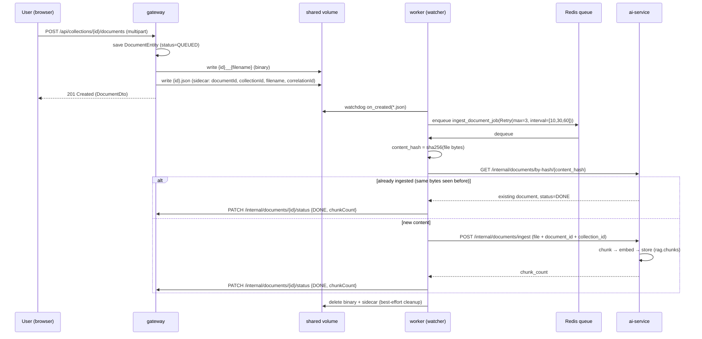
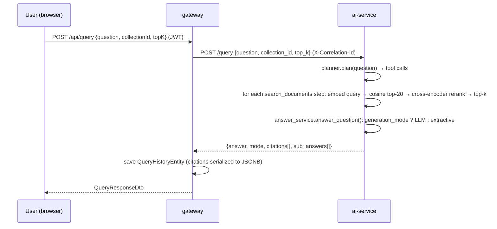

# Architecture

Deep technical reference for cortex. See [README.md](README.md) for the quickstart and the
high-level pitch.

## Contents

- [Services](#services)
- [Data flow: document upload → ingestion](#data-flow-document-upload--ingestion)
- [Data flow: a question → an answer](#data-flow-a-question--an-answer)
- [Data model](#data-model)
- [RAG pipeline internals](#rag-pipeline-internals)
- [Observability](#observability)
- [Security](#security)
- [Testing strategy](#testing-strategy)
- [Known trade-offs and what would change in production](#known-trade-offs-and-what-would-change-in-production)

## Services

| Service | Responsibility | Owns |
|---|---|---|
| `gateway` | Public API surface: auth, collections, document metadata/upload endpoint, query proxy, admin. Stateless, JWT-authenticated. | Postgres `public` schema (Flyway) |
| `ai-service` | The ML pipeline: chunking, embedding, storage, retrieval, reranking, generation, and the query-time agent/planner. Also the ingestion API the worker calls. | Postgres `rag` schema (SQLAlchemy `create_all`) |
| `worker` | Async ingestion: watches a shared filesystem volume for new uploads, hashes/dedupes them, pushes them to ai-service, reports status back to the gateway. Two processes from one image: a `watchdog`-based watcher and an RQ worker. | Nothing persistent — Redis queue state only |
| `frontend` | React SPA: auth, chat, collection/document management, admin panel. Served by nginx in production, which reverse-proxies `/api/*` to the gateway so the browser never needs CORS. | Nothing server-side |

**Why one Postgres instance instead of one per service?** Two schemas in one database gets
almost all of the isolation benefit (independent migrations, no shared tables, each service
only has credentials/knowledge of its own schema) without the operational cost of running,
backing up, and networking two separate database containers for a project this size. There
are no cross-schema foreign keys — `ai-service`'s `documents.id` and the gateway's
`documents.id` are the same UUID by convention, not by a database-level constraint.

**Why a filesystem watcher instead of gateway publishing directly to Redis?** The gateway
already needs to persist the uploaded file to a shared volume for the worker to read (the
file itself, not just metadata, has to cross the process boundary somehow). Given that,
writing directly to Redis from the gateway would mean two separate hand-off mechanisms
(volume for bytes, queue for the "process this" signal) that have to stay in sync. Instead,
the *sidecar JSON file's existence* is the signal: the worker's watcher only reacts to
`*.json` sidecar files, and the gateway writes the binary strictly before the sidecar, so a
half-written upload is never picked up. One hand-off mechanism, not two.

## Data flow: document upload → ingestion

If `POST /internal/documents/ingest` fails, RQ's built-in retry (`Retry(max=3,
interval=[10, 30, 60])`) re-runs the job with backoff; after the final attempt the job
reports `FAILED` with `errorMessage` back to the gateway, which the UI surfaces on the
document row.

The `PATCH /internal/documents/{id}/status` callback is authenticated by a shared
`X-Internal-Api-Key` header (`InternalApiKeyFilter`, `ROLE_INTERNAL`) rather than a user JWT —
the worker isn't acting on behalf of any particular user.

## Data flow: a question → an answer

`generation_mode` is resolved once per request from config
(`anthropic_api_key` set → `"anthropic"`; else `openai_api_key` set → `"openai"`; else
`"extractive"`), so which mode runs is a deployment-time decision, not a per-request choice.
If an LLM call raises for any reason, `answer_service` catches it and falls back to
extractive generation with `mode="extractive_fallback"`, so a transient LLM outage degrades
answer quality rather than the request failing outright.

## Data model

**gateway — Postgres schema `public` (Flyway, `V1__init_schema.sql`)**

- `users` (id, email unique, password_hash, role, created_at)
- `collections` (id, name, description, owner_id → users, created_at)
- `documents` (id, collection_id → collections indexed, filename, uploaded_by → users, status,
  chunk_count, error_message, uploaded_at)
- `query_history` (id, user_id → users indexed, collection_id, question, answer, mode,
  `citations_json JSONB`, created_at)

**ai-service — Postgres schema `rag` (SQLAlchemy `Base.metadata.create_all`, run at startup)**

- `documents` (id UUID — same value as the gateway's document id, by convention;
  collection_id indexed; filename; `content_hash` with a unique constraint — this is the
  idempotency mechanism; status; chunk_count; error_message; created_at)
- `chunks` (id UUID; document_id → `documents.id` **ON DELETE CASCADE**, indexed; chunk_index;
  page_number nullable; content text; `embedding vector(384)` via pgvector, matching
  `all-MiniLM-L6-v2`'s output dimension)

pgvector's `CREATE EXTENSION vector` is installed once via `infra/postgres-init/01-extensions.sql`,
mounted into `/docker-entrypoint-initdb.d` (runs only on first container init against an empty
data volume) against the `pgvector/pgvector:pg16` image.

## RAG pipeline internals

- **Chunking** (`ai-service/app/ingestion/chunker.py`): sentence-boundary aware — splits text
  into sentences, then greedily packs sentences into a chunk up to `chunk_size_chars` (1000
  chars by default), never splitting mid-sentence. Each new chunk is seeded with a
  sentence-level overlap tail (up to `chunk_overlap_chars`, 150 by default) from the end of the
  previous chunk, so context isn't lost at chunk boundaries.
- **Embedding** (`ai-service/app/embeddings/embedder.py`): `sentence-transformers/all-MiniLM-L6-v2`,
  loaded once and cached (`@lru_cache`), embeddings L2-normalized (`normalize_embeddings=True`)
  so cosine similarity reduces to a dot product.
- **Retrieval**: cosine similarity search over `rag.chunks.embedding`, filtered by
  `collection_id` when one is given, returning the top `retrieval_top_k` (20) candidates.
- **Reranking** (`ai-service/app/retrieval/reranker.py`): `cross-encoder/ms-marco-MiniLM-L-6-v2`
  scores all 20 retrieved (query, chunk) pairs directly (not via embedding similarity — a
  cross-encoder sees both texts jointly, which is slower but more accurate than the bi-encoder
  retrieval step), then returns the top `rerank_top_k`. Can be disabled
  (`reranker_enabled=false`) to just truncate the retrieval results, trading answer quality for
  latency.
- **Generation**: extractive (default, zero API key) assembles the answer directly from the
  top reranked chunks with numbered citations; `openai`/`anthropic` modes call out to a real
  LLM with the same retrieved context, when a key is configured.
- **Agent / planner** (`ai-service/app/agent/`): a deterministic, rule-based planner — not an
  LLM tool-calling loop. `planner.plan()` pattern-matches the question (greeting →
  `answer_directly`; comparison language → `compare_sections`; compound question split on `;`
  / "and then" / Polish "oraz" → multiple `search_documents` steps; otherwise a single
  `search_documents` step) and dispatches to a small fixed tool registry. This was a deliberate
  choice over an LLM-driven agent loop: it's deterministic and unit-testable without mocking an
  LLM, and it works identically in extractive mode as it does with a real LLM configured — the
  "agent" capability doesn't require an API key any more than single-shot querying does.

## Observability

- **Correlation IDs**: `CorrelationIdFilter` (gateway) reads or mints an `X-Correlation-Id`
  per request, binds it to SLF4J's MDC for the request's lifetime, echoes it in the response,
  and `WebClientConfig`'s exchange filter forwards it on every outbound call to ai-service.
  ai-service's own middleware reads that header and binds it to a `contextvar`
  (`app/logging.py`), so every log line — gateway or ai-service, for a single user request —
  carries the same id.
- **Structured logging**: SLF4J/MDC on the gateway side, `structlog` on the Python side.
- **Metrics**: Micrometer + `spring-boot-starter-actuator` expose `/actuator/prometheus` on the
  gateway; ai-service mounts `prometheus_client`'s ASGI app at `/metrics`.
- **Health checks**: `/actuator/health` (gateway, with liveness/readiness probes enabled) and
  `/health` (ai-service, actually executes `SELECT 1` against Postgres rather than just
  returning 200) gate Docker Compose's `depends_on: condition: service_healthy` ordering.

## Security

- **User auth**: stateless JWT (HS384), issued on register/login, validated per-request by
  `JwtAuthenticationFilter`. No server-side session state — `spring.session` creation policy is
  `STATELESS`.
- **Service-to-service auth**: a shared `X-Internal-Api-Key` header for the worker → gateway
  status callback, checked by a dedicated filter/role (`ROLE_INTERNAL`) rather than reusing the
  user-JWT machinery — the worker isn't acting as any particular user.
- **Errors**: RFC 7807 `application/problem+json` for every error response
  (`GlobalExceptionHandler`, `ProblemDetailAuthEntryPoint`, `ProblemDetailAccessDeniedHandler`),
  so clients get a consistent, machine-parseable error shape everywhere instead of ad hoc JSON.
- **Rate limiting**: fixed-window, keyed per authenticated user id (or IP for anonymous
  requests), in-memory (`ConcurrentHashMap`). See the trade-offs section below for why this
  isn't Redis-backed.
- **CORS**: allowed origins are configurable (`cortex.cors.allowed-origins`), but in the
  Docker Compose deployment the frontend's nginx reverse-proxies `/api/*` to the gateway on
  the same origin the browser sees, so CORS doesn't actually come into play there — it exists
  for running the Vite dev server against a separately-hosted gateway.

## Testing strategy

- **gateway**: JUnit 5 + Mockito for service-layer unit tests (mocking repositories/WebClient);
  Testcontainers-backed integration tests (`AuthenticationFlowIntegrationTest`) spin up a real
  Postgres and drive the full HTTP stack via MockMvc, including Flyway migrations and Spring
  Security — this is what caught the detached-entity JPA bug and the Jackson-3-vs-2 WebClient
  bug described in the README, neither of which a mocked unit test could have caught. The
  Postgres container is started once in a static initializer and shared across all test
  classes (deliberately *not* using `@Testcontainers`/`@Container`, whose per-class stop/start
  conflicts with Spring's `ApplicationContext` caching — see `AbstractIntegrationTest`'s
  Javadoc for the full failure mode).
- **ai-service / worker**: pytest (async mode auto-enabled for ai-service), `ruff` and `mypy
  --disallow-untyped-defs` enforced in the same run. No tests depend on network access to a real
  LLM — extractive mode makes the whole pipeline deterministically testable.
- **End-to-end**: the full Docker Compose stack was driven through a real browser session
  (register → create collection → upload → poll for ingestion → ask a question → verify
  citations → admin role management) as part of building this project — see the README's
  Engineering notes for the bug that surfaced only at that level.

## Known trade-offs and what would change in production

- **In-memory rate limiting** only works correctly with a single gateway instance. Scaling the
  gateway horizontally would need a Redis-backed limiter (a token-bucket or sliding-window
  implementation against the Redis instance already in the stack) instead.
- **One Postgres instance, two schemas.** Fine at this scale; a heavier ai-service workload
  (e.g., much larger embedding tables) would eventually warrant splitting it out to isolate
  I/O and enable independent scaling/backup policies.
- **Filesystem-volume hand-off** between gateway and worker assumes both containers share a
  volume, which means they must be co-located (same Docker host / same Kubernetes node pool
  with `ReadWriteMany`, or an object-store-backed volume). A message-queue-native hand-off
  (gateway uploads to S3-compatible storage, publishes an event) would remove that constraint
  for a genuinely distributed deployment.
- **No horizontal scaling of ai-service's embedding/reranking models** — they're loaded into
  process memory once per container. Multiple replicas behind the gateway's WebClient would
  each pay the model-load cost independently; a dedicated model-serving layer would amortize
  that if load justified it.
