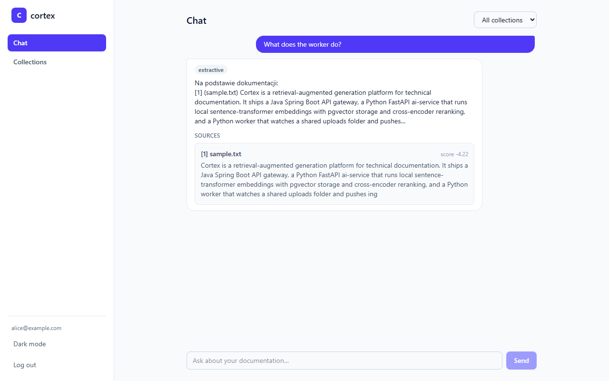
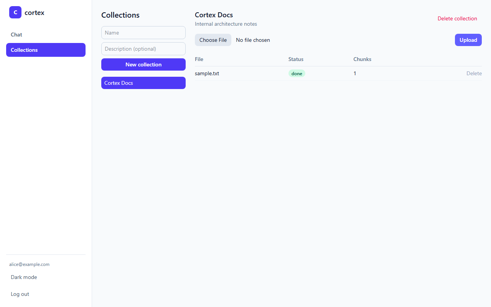
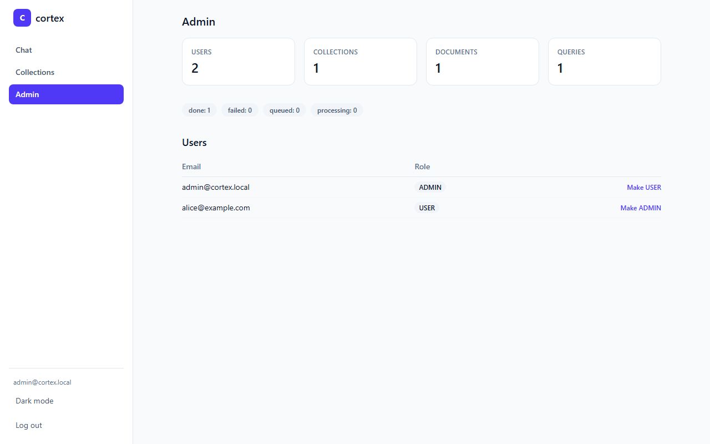

# cortex

A microservices RAG (retrieval-augmented generation) platform for technical documentation:
upload documents, ask questions in natural language, get answers with citations back to the
source chunks. Built as a portfolio project to demonstrate production-shaped service design —
schema-per-service data ownership, idempotent async ingestion, correlation-ID tracing across
service boundaries, and a generation pipeline that works with **zero API keys** out of the box.



## Why this exists

Most RAG demos are a single Python script with an in-memory vector store. Cortex is instead
built the way a small team would actually ship it: a stateless API gateway in front of clients,
a Python service that owns the ML pipeline, a background worker that owns ingestion, and a
Postgres instance that both share without touching each other's tables. The interesting parts
are the seams between those services — and a few real bugs the seams exposed (see
[Engineering notes](#engineering-notes) below).

## Architecture

```mermaid
flowchart LR
    subgraph Client
        FE[React SPA]
    end

    FE -->|"/api/* (JWT)"| GW[gateway<br/>Java 21 / Spring Boot 4]
    GW -->|"POST /query"| AI[ai-service<br/>Python / FastAPI]
    GW -->|"binary + sidecar JSON"| VOL[(shared uploads volume)]
    GW -->|Flyway-managed schema| PG[(Postgres + pgvector)]

    VOL -->|watchdog| W[worker<br/>Python / RQ]
    W -->|enqueue| R[(Redis)]
    R --> W
    W -->|"ingest chunks + embeddings"| AI
    W -->|"PATCH status (internal API key)"| GW
    AI -->|SQLAlchemy, schema "rag"| PG
```

Three backend services, one shared Postgres instance split by schema (`public` for the
gateway, `rag` for ai-service — no cross-schema foreign keys, so each service's migrations
are independent), Redis as the ingestion queue, and a folder-watcher instead of a message
bus for the gateway → worker handoff (see [ARCHITECTURE.md](ARCHITECTURE.md) for why).

Full technical deep-dive, data flow diagrams, and the RAG pipeline internals are in
[ARCHITECTURE.md](ARCHITECTURE.md).

## Screenshots

| Chat with citations | Document ingestion | Admin panel |
|---|---|---|
|  |  |  |

## Tech stack

| Service | Stack |
|---|---|
| `gateway` | Java 21, Spring Boot 4.1.0, Spring Security (JWT), Spring Data JPA, Flyway, WebClient, JUnit5 + Mockito + Testcontainers |
| `ai-service` | Python 3.12, FastAPI, SQLAlchemy (async) + pgvector, sentence-transformers, cross-encoder reranking, pytest + mypy + ruff |
| `worker` | Python 3.12, watchdog, RQ (Redis Queue), pytest + mypy + ruff |
| `frontend` | React 19, TypeScript, Vite, Tailwind v4, react-router |
| Infra | PostgreSQL 16 + pgvector, Redis 7, Docker Compose, nginx (frontend reverse proxy) |

## Quickstart

Requires Docker Desktop (or another Docker Engine + Compose v2).

```bash
cd infra
docker compose up -d --build
```

This builds and starts all five services plus Postgres and Redis, with healthchecks gating
startup order (gateway waits on Postgres + ai-service; frontend waits on gateway). First boot
takes a few minutes — ai-service downloads its embedding and reranking models on first startup.

Once healthy:

- **App**: http://localhost:5173
- **Gateway API / Swagger**: http://localhost:8080/swagger-ui.html
- **ai-service docs**: http://localhost:8001/docs

A default admin account is seeded on gateway startup: `admin@cortex.local` / `changeme123`
(override via `CORTEX_ADMIN_EMAIL` / `CORTEX_ADMIN_PASSWORD`). Register a normal account
through the UI to try the end-user flow: create a collection, upload a `.txt`/`.pdf`/`.docx`
file, wait for it to reach `done`, then ask a question in Chat.

No OpenAI/Anthropic key is required — without one, ai-service runs in **extractive mode**
(answers are built directly from the highest-scoring retrieved chunks). Set
`OPENAI_API_KEY` or `ANTHROPIC_API_KEY` in `infra/docker-compose.yml`'s `ai-service`
environment to switch to real LLM generation.

## Running the test suites

```bash
# gateway — 26 tests, including Testcontainers-backed integration tests
cd gateway && ./mvnw test

# ai-service
cd ai-service && python -m pytest && ruff check . && mypy app

# worker
cd worker && python -m pytest && ruff check . && mypy worker
```

## Engineering notes

A few decisions and bugs worth calling out — the kind of thing that only shows up once you
run the whole stack together, not in isolated unit tests:

- **Spring Boot 4, not 3.** `start.spring.io` now generates Boot 4 (Spring Framework 7) by
  default; rather than pin an EOL-adjacent 3.x version, the gateway targets 4.1.0. That
  surfaced several real migration issues along the way — Boot 4 splits autoconfiguration into
  much finer-grained starter modules (Flyway needed its own `spring-boot-starter-flyway`, not
  just `flyway-core`), and defaults to Jackson 3 for its auto-configured JSON handling. The
  second one caused a genuine production bug: the gateway's outbound `WebClient` to ai-service
  silently deserialized every field to `null` because Jackson 3's codec doesn't recognize the
  classic `@JsonNaming` annotations on the DTOs — caught by an end-to-end smoke test against
  the full Docker Compose stack, not by any unit test (`QueryServiceTest` mocks `WebClient`
  entirely). Fixed by wiring explicit classic-Jackson2 codecs onto the WebClient.
- **A real JPA bug, caught by a Testcontainers integration test.** With
  `spring.jpa.open-in-view=false`, a service method that calls `repository.findById(...)` and
  then mutates the returned entity — without an explicit `@Transactional` or a trailing
  `.save()` — mutates a *detached* entity. Hibernate's dirty-checking never runs, so the change
  silently never reaches the database. `AuthenticationFlowIntegrationTest`'s full
  register → upload → status-callback → re-fetch journey caught this on
  `DocumentService.applyStatusUpdate`; the same pattern was proactively fixed in
  `AdminService.updateRole`.
- **The RAG pipeline runs with zero external API calls by default.** Embeddings
  (`sentence-transformers/all-MiniLM-L6-v2`) and reranking
  (`cross-encoder/ms-marco-MiniLM-L-6-v2`) run locally in ai-service; generation falls back to
  an extractive mode that assembles an answer directly from the top reranked chunks. This
  makes the whole system runnable and demoable without signing up for anything, and it's also
  what the automated tests exercise — no flaky/costly calls to a real LLM in CI.
- **Ingestion is idempotent by content hash**, not by filename or document ID: the worker
  SHA-256-hashes the uploaded file and ai-service enforces a unique constraint on that hash, so
  re-uploading the same bytes (even under a different collection or filename) is detected and
  short-circuited rather than re-embedded.
- **The "agent" is a deterministic planner, not an LLM function-calling loop.** Compound or
  comparison questions get split into sub-questions by a small rule-based planner
  (`ai-service/app/agent/planner.py`) that dispatches to a fixed tool registry
  (`search_documents`, `compare_sections`, `answer_directly`). That's a deliberate trade-off:
  it's fully deterministic, testable without mocking an LLM, and works identically whether or
  not a real generation API key is configured.
- **Rate limiting is in-memory, not Redis-backed**, because the gateway runs as a single
  instance in this deployment — a documented scaling trade-off, not an oversight (see
  `RateLimiter`'s Javadoc and [ARCHITECTURE.md](ARCHITECTURE.md)).

## License

MIT
